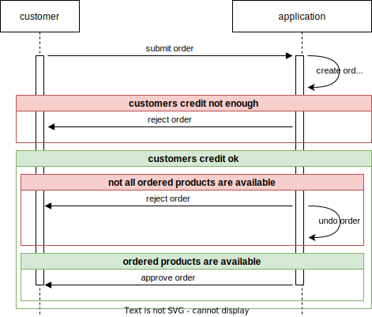

# Demo implementation of 4 microservices

This project contains a demo implementation of 4 micro services. Together they fullfill the following functional requirements:

* customers should be able to order products
* each customer should have an individual credit limit
* a new order should get rejected when customers credit is not enough
* a new order should get rejected when not all ordered products are available
* the services should support horizontally scaling (running multiple instances in parallel)
* a problem in a service should not bring the application down (fault tolerance)

## overview

The following diagram illustrates the internal structure of the application.

Everything is implemented in Javascript and each service (including the static webpage) uses [Node.js](https://nodejs.org) and [Express](http://expressjs.com) on top of it. The implemented scenario is shown in the following diagram.

## deployment

The code of all 4 services is available in this repository. We know that it is not best practice to have them all together in the same repository but it made it much easier to get the project up and running in the limited time we had. In a "real" productive system each service and also commonly used code would be in seperate repositories and each service would get its own docker image.

Prerequisites:
* GIT client (for cloning the repository)
* Visual Studio Code
* [BICEP extension](https://marketplace.visualstudio.com/items?itemName=ms-azuretools.vscode-bicep) for Visual Studio Code
* Account at Microsoft Azure

**When you do not need the application, don't for get to remove the resources in Azure because the API-gateway costs money!**

To deploy the application, the following steps are necessary ...
* Clone this repository and open it in Visual Studio Code ("File > Open Folder ...")
* Click with your right mouse button on *azureDeployment/main.bicep* and select "Deploy Bicep File ...".
* Follow the menu provided by the BICEP extension.
* In the "OUTPUT" tab of Visual Studio Code you'll find an URL pointing you to the deployment status page of Azure. Move your mouse over the URL and click on "Follow link".

* Wait a few minutes till Azure tells you that the deployment finished.

A detailed description how to use the BICEP extension of Visual Studio Code is available [here](https://learn.microsoft.com/en-us/azure/azure-resource-manager/bicep/deploy-vscode).

## known deployment problems

In the past sometimes run into the problem that Azure cancels the deployment with the statement "Network is not ready for container group 'products-service'. Please try again.". In such a sitation repeating the deployment solves the problem.

The deployment will fail, when somebody else already deployed it to Azure. The reson for this is the name of the Azure AppConfiguration Service, which has to be unique in Azure and you need to change it in *azureDeployment/appConfiguration.bicep* if the deployment fails.

## using it

To use the application you first need to get the public IP address. There are three possible ways to get it:
* Open the API gateway in the Azure portal and look for "Frontend public IP address" in the overview tab.
* Open the public IP address in the Azure portal and look for "IP address" in the overview tab.
* Open the Azure App Configuration and look for "API_GATEWAY_IP_ADDR" in the "Configuration explorer" tab.

When you enter the IP address into your address field of your web browser you'll get the following webpage.

The real-time views poll the data of the corresponding service every second and display them in a human readable way. 

The Swagger links point to the [Swagger UI](https://swagger.io/tools/swagger-ui/) pages of the corresponding service to interact with it.

## running services locally (Linux)

To run one of the services locally in e.g. a Linux VM you need to ...
* Deploy at least the database and the App Configuration. This can be done by commenting out the last module (the API gateway) in *azureDeployment\main.bicep* and deploy it in the same way as described in the section "deployment".
* While the deployment is running, clone this repository and wait till the deployment finished successfully. 
* Open the "Configuration explorer" tab of the Azure App Configuration and look for the value of "APP_CONFIG_CONNECTION_STRING".
* Set the environment variable APP_CONFIG_CONNECTION_STRING to the value you found in the Azure App Configuration.
* Run startService.sh and provide as first argument the name of the service you want to start (one of: "webserver", "customers", "orders", "products").

## running services locally (Windows)

To run one of the services locally on Windows you need to ...
* Deploy at least the database and the App Configuration. This can be done by commenting out the last module (the API gateway) in *azureDeployment\main.bicep* and deploy it in the same way as described in the section "deployment".
* While the deployment is running, clone this repository and wait till the deployment finished successfully. 
* Open the "Configuration explorer" tab of the Azure App Configuration and look for the value of "APP_CONFIG_CONNECTION_STRING".
* Set the environment variable APP_CONFIG_CONNECTION_STRING to the value you found in the Azure App Configuration.
* Execute openCliHere.bat (it will complain that grunt is missing)
* Execute "npm install" to install all dependencies.
* Close the command line box.
* Execute openCliHere.bat once again.
* Take the path to the main file from services.cfg and provide it as first argument to "node" (e.g. "node services/products/src/Main.js").

## removing the deployed components

The fastes way to remove all deployed resources in Azure is to delete the resource group "rg-demoproject", which got created by the deployment of this project and contains all its resources. 